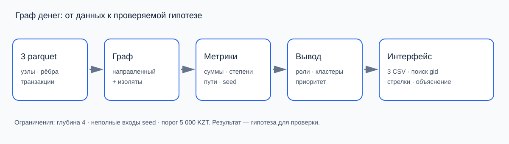

# Money Graph — Team “50 Tenge”

[Русский](README.md) | **English**

**Which of the 2,248 clients should an analyst review first, and why?** Money Graph helps bank AML analysts investigate an anonymized transaction network. It proposes structural roles, identifies groups, and produces an explainable review queue.

Built for the HackAlem AI case, the project starts with 81 seed clients supplied by the organizers. Analysts receive client cards with metrics, reasons for prioritization, connections, and data limitations.

**Roles are hypotheses for investigation. No score represents a probability of guilt.** The application and analyst-facing explanations are currently in Russian; this document provides English setup and method documentation.

## Quick start

You need Python with `venv` support (3.12 recommended) and `make`. On Linux, macOS, or WSL, one command after cloning prepares and starts the application:

```bash
git clone https://github.com/BAITC-Hacks/hack-67979f3c-50-tenge.git
cd hack-67979f3c-50-tenge
make
```

`make` creates `.venv`, installs dependencies, computes all outputs, and starts the dashboard at **[http://localhost:8501](http://localhost:8501)**. No manual environment activation is needed. The first run needs internet access to install packages; subsequent runs reuse the environment. Dependencies are installed again when `requirements.txt` or `starter/requirements.txt` changes. Press `Ctrl+C` to stop the local server.

The three source Parquet files must be in `data/`. Core analysis requires no API key, GPU, or cloud service. To create the environment with a specific interpreter, use `make PYTHON=python3.12`. To use another local port, run `make PORT=8502`.

| Command | Action |
|---|---|
| `make` / `make run` | Prepare the environment, compute results, and start the dashboard |
| `make pipeline` | Generate all CSV and JSON outputs without starting the dashboard |
| `make ui` | Open the dashboard using existing outputs |
| `make test` | Run the test suite |
| `make setup` | Install dependencies only |
| `make help` | List available commands |

### Without Make

```bash
python3 -m venv .venv
source .venv/bin/activate
python -m pip install -r requirements.txt
python run.py --data data --out out
python -m streamlit run viz/app.py
```

On Windows PowerShell, create the environment with `py -3.12 -m venv .venv` and activate it with `.venv\Scripts\Activate.ps1`; the remaining commands are the same. Use WSL to run the Makefile on Windows.

After installation, `python run.py --data data --out out` recomputes all outputs independently of the dashboard. A Docker workflow is also available through `make docker-up`, described below.

## Implemented features

- Input validation and reconciliation of aggregated edges with transaction pairs, amounts, and counts.
- A complete directed graph, including clients without observed connections.
- Six rule-based roles, each with a score, the matching rule, and a numerical explanation.
- An inspection priority with four separately reported contributions and a top-30 list.
- Community detection, group hypotheses, internal turnover, and directed flows between groups.
- Group stability across ten alternative random starts, identifying core and disputed memberships.
- A dashboard with exact gid search, filters over the full dataset, client cards, one- or two-hop neighborhoods, transfer tables, and group membership.
- Downloadable required CSVs, selected group members, and run metadata.
- An optional AI assistant that explains computed facts and suggests missing information to request.
- Daily activity patterns, explainable unusual profiles, recurring routes, and short cycles.
- Top-N node removal scenarios compared with random removal.
- An AI agent with restricted graph-query functions, plus local common-recipient search without an API key.

## User workflow

1. **Provide data.** Put `nodes.parquet`, `edges.parquet`, and `transactions.parquet` in `data/`. Run `make` or the pipeline command.
2. **Compute results.** The pipeline validates inputs, builds the graph, computes features, assigns roles and groups, ranks clients, and writes outputs to `out/`.
3. **Select a client.** Use the review queue or paste a full gid. Exact search covers all clients regardless of queue filters.
4. **Inspect the evidence.** The tabs “Схема связей” (Connections), “Переводы” (Transfers), “Группа клиента” (Client group), and “Расчёт и основания” (Calculations and evidence) show directions, metrics, thresholds, and score contributions.
5. **Choose the next investigation step.** Review limitations, identify missing information, and download results or an assistant brief. The analyst makes the final decision.

## Metrics, roles, and thresholds

### Why these metrics

| Metric | Purpose |
|---|---|
| `in_deg`, `out_deg` | Number of distinct senders and recipients: collection and distribution patterns |
| `in_kzt`, `out_kzt` | Observed incoming and outgoing amounts: activity scale |
| `in_tx`, `out_tx`, average amounts | Distinguish one large transfer from many smaller ones |
| `pass_through = out_kzt / in_kzt` | Similarity of observed input and output volumes: possible transit |
| `betweenness` | Brokerage on shortest directed paths; distance is the number of hops, not the transfer amount |
| `pagerank` | An additional measure using direction and amounts; not used directly in role rules or priority |
| `seed_reach_count`, `seed_distance` | Distinct seeds reaching a node within 1–4 directed hops, and minimum distance |
| `depth`, `truncated_by_depth`, `wcc_id` | Exploration depth, observation boundary, and weakly connected component |

Degree counts counterparties; transaction count counts individual transfers. Ten transfers to one recipient produce `out_deg=1` and `out_tx=10`.

### Role assignment

Rules are evaluated **from top to bottom**; the first match determines the primary role. A non-seed client is outside the initial list. `Q75` is the 75th percentile of positive non-seed incoming amounts; `Q95` is the 95th percentile of positive betweenness values across all nodes. Quantiles are recalculated with linear interpolation; an empty sample disables the corresponding rule.

| Order | Role | Condition |
|---:|---|---|
| 1 | `peripheral`: insufficient data | Both incoming and outgoing degrees are zero |
| 2 | Boundary `consolidator` / `peripheral` | At `depth=4` with `out_deg=0`: consolidator if non-seed, `in_deg≥3`, and `in_kzt≥Q75`; otherwise peripheral. Terminal is forbidden |
| 3 | `coordinator`: structural connector | Non-seed; has input and output; `seed_reach_count≥2`; `betweenness≥Q95` |
| 4 | `consolidator`: collection indicators | Non-seed; `in_deg≥3`; `in_deg≥2×max(out_deg,1)`; `in_kzt≥Q75` |
| 5 | `distributor`: distribution indicators | `out_deg≥5`; non-seeds also require `out_deg≥2×max(in_deg,1)` |
| 6 | `terminal`: observed endpoint | Non-seed; has input; `out_deg=0`; `depth<4` |
| 7 | `transit`: transit indicators | Non-seed; has input and output; `0.7≤pass_through≤1.3` |
| 8 | `peripheral`: unresolved role | All remaining cases |

For the supplied dataset, **Q75 = 165,000 KZT** and **Q95 ≈ 0.00133618**. Exact values are saved in `out/run_metadata.json`.

`role_score` describes the strength of observed indicators, accounting for limitations. Let `E(x,t)=clip((x/t−1)/2,0,1)`, where `clip` restricts the result to 0..1:

| Role | `role_score` |
|---|---|
| consolidator | `0.55 + 0.15×E(in_deg,3) + 0.15×E(in_kzt,Q75)`; subtract 0.15 at the boundary |
| distributor | `0.55 + 0.30×E(out_deg,5)` |
| coordinator | `0.45 + 0.15×E(betweenness,Q95) + 0.15×E(seed_reach_count,2)` |
| transit | `0.45 + 0.20×clip(1−abs(pass_through−1)/0.3,0,1)` |
| terminal | 0.55 |
| peripheral | 0.10 for isolates, 0.15 for unresolved boundary nodes, 0.20 otherwise |

Thresholds and coefficients are transparent team heuristics, not learned or statistically calibrated parameters. See [role rules](docs/roles.md) for details in Russian.

### Priority and communities

```text
priority_score = 0.35×P(volume) + 0.30×P(betweenness)
               + 0.20×min(seed_reach_count/3, 1) + 0.15×P(degree)
```

`P` is the average rank among positive values divided by their count; zero maps to zero. For seeds, volume is `out_kzt` and degree is `out_deg`. For other nodes, volume is `max(in_kzt,out_kzt)` and degree is `in_deg+out_deg`. Isolates receive zero priority.

Nodes are sorted by descending score, breaking ties by gid. If seeds exceed one third of the initial top-30, the final list is restricted to non-seeds. The current list contains 4 seeds, so this filter is not applied. Priority is not multiplied by role confidence: an uncertain node can still merit review.

Louvain runs within each weakly connected component on an **undirected projection** that sums amounts in both directions. Main settings are `resolution=1.0` and `seed=42`. Role assignment, priority, and flow summaries retain the original directions.

Ten runs with alternative algorithm seeds assess repeatability. A node is `core` if it retains its matched membership in at least 80% of runs; group composition is compared using Jaccard similarity. Stability is not proof of correctness. An experimental consensus partition is evaluated in metadata and does not replace the production `cluster_id`. See [clustering and ranking](docs/ranking.md).

## Outputs

| File | Contents |
|---|---|
| `out/nodes_roles.csv` | 2,248 rows: gid, role, role score, cluster, priority, numerical evidence up to 200 characters, additional metrics and membership stability |
| `out/clusters.csv` | One row per group: size, seed count, internal turnover, leading gids, hypothesis, and stability diagnostics |
| `out/top_nodes.csv` | 30 clients: rank, gid, role, priority, and numerical reasoning |
| `out/temporal_patterns.json` | Daily activity, temporal indicators, repeated amounts, and within-depth profile comparisons |
| `out/network_patterns.json` | Routes, cycles, and node removal scenarios |
| `out/run_metadata.json` | Role thresholds, library versions, clustering settings and diagnostics, run duration |

Required columns are preserved:

```text
nodes_roles: gid, role, role_score, cluster_id, priority_score, evidence
clusters:    cluster_id, n_nodes, n_seed, sum_kzt_internal, top_gids, hypothesis
top_nodes:   rank, gid, role, priority_score, why
```

CSV identifiers are int64; the browser receives them as strings. Import gid columns as text when using spreadsheet software to avoid rounding long identifiers.

`out/` is generated and excluded from git. Submit the three required CSVs separately, together with the repository, [SVG diagram](docs/scheme.svg), and demonstration. Rerunning the pipeline overwrites outputs.

## Architecture



[Mermaid diagram source](docs/scheme.md). Diagram labels are in Russian.

```text
data/*.parquet
  → io.py: loading and validation
  → graph.py: complete nx.DiGraph
  → features.py + seeds.py: metrics and reachability
  → roles.py: role, score, evidence
  → clusters.py + stability.py: communities and stability
  → priority.py: review queue
  → outputs.py: three CSVs + run.py: metadata
  → viz/app.py: search, client cards, graph, transfers, groups
       ↳ ai_assistant.py / ai_transport.py: optional API explanation
       ↳ graph_agent.py: restricted graph-query functions
  → temporal.py / routes.py → additional JSON → bonus_panels.py
```

`run.py` connects the analysis modules. Streamlit reads computed CSVs, source edges, and metadata; dashboard interactions do not rerun the entire pipeline. Tests live in `tests/`; detailed methods are in `docs/`. Source files in `data/` and `starter/` remain unchanged.

## Technologies and AI

| Area | Technologies |
|---|---|
| Language and tables | Python, pandas, NumPy, PyArrow / Parquet |
| Graph analysis | NetworkX, SciPy; PageRank, betweenness, BFS, Louvain |
| Dashboard | Streamlit, PyVis / vis-network with embedded graph JavaScript |
| Validation | pytest, CLI integration tests, Streamlit AppTest |
| Packaging | Python venv, Make, Docker, Docker Compose |
| Optional assistant | OpenAI Responses API; default model in the code: `gpt-4.1-mini`, configurable with `OPENAI_MODEL` |

**No model training is required.** Graph algorithms and rules produce roles, communities, and priority. The dataset contains no ground-truth role labels. The LLM explains computed facts and selects permitted graph queries; it does not change scores or CSV outputs.

### Optional assistant setup

Create a local `.env` file in the repository root:

```dotenv
OPENAI_API_KEY=your_key
OPENAI_MODEL=gpt-4.1-mini
```

`.env` is excluded from git. Environment variables override file settings. Docker Compose passes these variables to the `dashboard` service.

In the “Помощник” (Assistant) tab, enter a question and click “Получить объяснение” (Get explanation). Only this action sends the question, computed client metrics, and up to ten largest incoming and ten largest outgoing connections to OpenAI. The context can be inspected before sending. Internet access and API access to the chosen model are required; API requests may incur charges.

Responses are checked for structure and valid fact references. These checks do not guarantee that every statement is correct, so the text is shown as a draft for analyst review. Redisplaying a cached answer within the session does not send another request. Computations, cards, graphs, and local facts remain available without an API key. Requests do not enrich source data with external client information.

The separate “Задать вопрос по сети” (Ask about the network) agent can call restricted functions: a client card, common recipients reachable from every supplied source, a directed path, and leading clients in a selected group. It is limited to three API requests and six local operations per question, with results capped at 20 clients and four hops. Operation results and client references accompany the answer. Common-recipient search also works locally without AI. See [agent method and limits](docs/graph-agent.md).

## Additional analysis

The standard run also generates `out/temporal_patterns.json` and `out/network_patterns.json`. Extra temporal counts, within-depth percentiles, and explanations are added to `nodes_roles.csv`. Primary roles and priorities remain unchanged.

- **Client activity:** daily flows, incoming followed by outgoing activity within one or two days, synchronized inflows, spikes, repeated amounts, and unusual profiles compared with the same depth. See [formulas](docs/temporal.md).
- **Routes and cycles:** recurring A→B→C routes with date examples and directed cycles of length two or three. Up to 100 of each are saved with total counts. Client filtering searches this saved subset, not every route in the graph.
- **Network resilience:** removal of the top 1/3/5/10/20 nodes, remaining largest component size, fragmentation of the original component, and comparison with twenty random removals of the same size. See [method](docs/routes.md).

Temporal matches and cycles do not establish that the same funds moved along a route. Repeated amounts do not prove transaction splitting; transfers below 5,000 KZT are invisible. Node removal is a scenario on the observed graph, not a forecast of activity ending. These methods use documented rules and require no separate ML training.

The previously recorded local run with additional analysis took 4.42 seconds for 2,248 clients, 107 groups, and a top-30 list. It found 112 recurring routes and 218 short cycles. These timings depend on the machine. Final verification: 157 tests passed in a clean Python environment without an API key; pip check found no dependency conflicts. Repeated runs produced byte-identical mandatory CSV files and both additional JSON reports within the same environment. The repeat run took 4.41 seconds; the Docker pipeline with Python 3.12 took 2.92 seconds (installation/build excluded). Chrome rendered the graph and additional-analysis routes/cycles without application errors. AI transport and graph tool calls were tested with mocked API responses; no live API request was made. See the Russian README for the full verification scope.

## Docker alternative

A running Docker Engine, Docker Compose, and Buildx are required. With Make installed:

```bash
make docker-up
```

This computes outputs first and starts the dashboard in the background only after a successful run. Host Python is not required. Stop with `make docker-down`; recompute without opening the dashboard with `make docker-pipeline`.

Without Make:

```bash
docker compose run --build --rm pipeline
docker compose up --build -d dashboard
```

Open [http://localhost:8501](http://localhost:8501). Source data is mounted read-only; outputs remain in the local `out/` directory. Stop services with:

```bash
docker compose down
```

If building reports a missing `docker-buildx`, install Buildx for your Docker setup or use the Python workflow. The `pipeline` service computes results; `dashboard` reads them.

## Data and integrations

The only analysis data source is the organizers’ anonymized dataset for **July 1–31, 2026**.

| File | Rows | Fields |
|---|---:|---|
| `data/nodes.parquet` | 2,248 | `gid`, `depth`, `is_seed` |
| `data/edges.parquet` | 3,119 | `src`, `dst`, `sum_kzt`, `n_tx`, `depth` |
| `data/transactions.parquet` | 4,840 | `src`, `dst`, `date`, `sum_kzt` |

The graph follows outgoing transfers from 81 seeds to depth four, with a minimum visible transaction of 5,000 KZT. The full graph has 35 weakly connected components: 16 with edges and 19 isolates. Transactions validate aggregates and support additional temporal analysis; temporal indicators do not change primary roles.

There is no connection to banking systems, personal-information databases, or external enrichment sources. OpenAI is the only optional external API, used for explanations and restricted graph queries. The source data was supplied for the hackathon; gids are synthetic identifiers.

## Limitations and scaling

- **Limited coverage:** other banks, periods, balances, and transfers below 5,000 KZT are missing. Full client balances cannot be reconstructed.
- **Depth-four boundary:** missing outgoing edges do not establish that funds stayed with a client. Seed inflows are particularly incomplete and do not determine their role.
- **Connections do not establish provenance:** matching amounts or seed reachability do not prove movement of the same funds. A coordinator is a structural connector, not a proven organizer.
- **No ground truth:** thresholds and weights are heuristic. Accuracy, probabilities of wrongdoing, and proven group correctness are not claimed.
- **Ranking favors the largest component:** all current top-30 nodes are in it. Full-table filters allow exploration of other groups and lower-ranked clients.
- **Limited stability assessment:** ten Louvain starts with fixed data and resolution do not model missing observations. The consensus experiment is not an independent quality assessment.
- **Display limit:** neighborhoods show up to 200 nodes and report omissions; calculations use the full graph. The tool is for local analysis without multi-user authentication or production banking integration.
- **AI can be wrong:** the assistant sees a selected card; the graph agent sees bounded query results. Format and reference checks do not replace human review.

### Scaling to one million nodes

The implementation targets the supplied dataset; performance at one million nodes has not been measured. Scaling would require:

- Columnar storage for edges and features, transaction processing in date/client batches, and compact CSR representations instead of Python objects per node and edge.
- Approximate betweenness with a fixed source sample and compiled graph implementations, verifying consistent treatment of directions, weights, and isolates.
- Background community-detection runs and stability measurements without dense all-pairs matrices.
- Route search bounded by length, dates, and selected neighborhoods, with indexes for daily connections.
- Separate node-removal jobs with explicit scenario and random-comparison budgets.
- Paginated tables and indexed neighborhood retrieval; AI receives bounded query results rather than the full graph.

Memory and runtime depend on edges, transactions, and degree distributions, not just node count. Any replacement implementation must first be compared with the current formulas on a small dataset and then benchmarked separately.

## Deployment and submission materials

**There is no public deployed version yet.** Run the project locally using the instructions above. `localhost:8501` refers to the machine running the dashboard, not a public URL.

Supporting documents are in Russian:

- [Demo with additional scenarios](docs/demo.md).
- [Temporal features](docs/temporal.md), [routes and resilience](docs/routes.md), [AI queries](docs/graph-agent.md).
- [Full case specification](docs/tz.md).
- [Role criteria and scores](docs/roles.md).
- [Communities, priority, and stability](docs/ranking.md).
- [Slide diagram — SVG](docs/scheme.svg), [Mermaid](docs/scheme.md).
- Required files for the jury: `out/nodes_roles.csv`, `out/clusters.csv`, `out/top_nodes.csv`.

## Priority weight sensitivity

The calculation tab shows eight scenarios: each priority weight is multiplied by 0.8 and 1.2 separately, then all weights are normalized. The documented seed selection policy is reapplied. Between 28 and 30 baseline top-30 clients remain on this dataset. Per-client results include top-list inclusion counts and overall rank range. Results are stored in run_metadata.json under priority_sensitivity; mandatory CSVs retain their original ranking. This is a limited sensitivity experiment, not a detection accuracy estimate. Full calculation took 4.70 seconds.

## Collectors queue and secondary signals

The “Открыть очередь сборщиков” shortcut clears search and filters and lists all clients whose primary role is consolidator (70 in this dataset), ordered by the existing priority. The official top-30 is unchanged. Cards also show other matching rules using the same predicates as primary role assignment. Multiple signals are not independent evidence; collection does not establish retained account balances.
