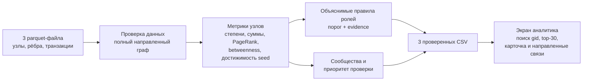

# Схема решения

Роли и приоритет — гипотезы на наблюдаемом графе. Граница глубины 4, неполные входы seed и порог 5 000 KZT выводятся аналитику вместе с результатом. Для презентации приложен [SVG](scheme.svg).
